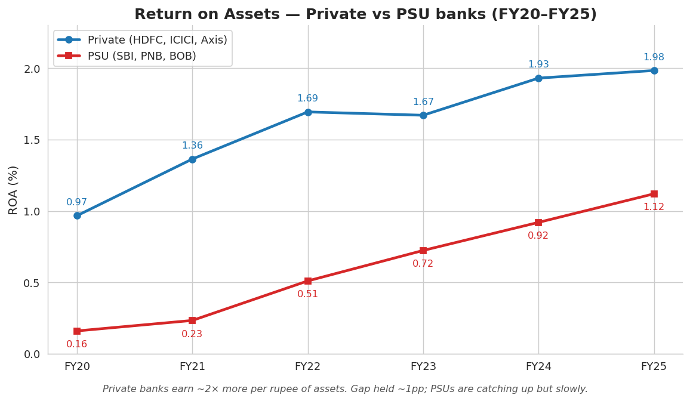
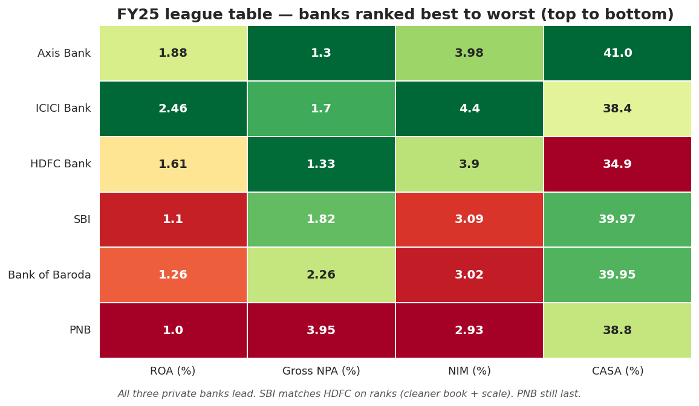

# 🏦 Private vs PSU Banks in India — A Strategic Analysis (FY20–FY25)

> Why are private banks like HDFC and ICICI earning ~2× more per rupee of assets than state-owned giants like SBI and PNB — and what should the PSU CEO actually do about it?

🔗 **[Live Tableau dashboard →](https://public.tableau.com/app/profile/priyanshu.moudgil/viz/PrivatevsPSUBanksinIndiaAStrategicAnalysis/PrivatevsPSUBanksinIndiaFY20FY25)**



---

## The problem

Read any Indian business newspaper and you'll see the same headline every quarter: *"PSU banks are catching up."* Are they really? I wanted to actually look at six years of audited numbers and decide for myself, instead of trusting the analyst recap.

So I picked the six biggest banks in India — three private (HDFC, ICICI, Axis) and three PSU (SBI, PNB, Bank of Baroda) — that together hold roughly **60–70% of all Indian banking assets**. Six years × six banks = 36 observations. Enough to see real structural trends, not just one good quarter or one bad one.

---

## What it does

- Pulls 6 years of audited financials (FY20–FY25) from each bank's annual reports into a single CSV
- Loads it into a **SQLite warehouse** so I can write real SQL against it
- Runs **6 SQL queries** — one per business question (profitability, asset quality, growth, funding, pricing, FY25 league table)
- Generates **6 publication-quality charts** in Python (matplotlib + seaborn)
- Packages findings into a **4-sheet Excel workbook** with 84 live AVERAGEIFS formulas
- Ships an interactive **4-chart Tableau Public dashboard**
- Plus a self-contained **HTML interactive dashboard** that opens in any browser
- Ends with a **1-page Word memo** with 3 strategic recommendations for the PSU CEO

---

## Tech stack


---

## How to run it locally

```bash
git clone https://github.com/PriyanshuMoudgil12/private-vs-psu-banks-india.git
cd private-vs-psu-banks-india
pip install pandas matplotlib seaborn openpyxl jupyter
```

Then:

1. **Generate the dataset** (writes `data/bank_financials.csv`, 36 rows):
   ```bash
   cd data && python3 build_dataset.py
   ```

2. **Build the SQLite warehouse:**
   ```bash
   python3 -c "import pandas as pd, sqlite3; pd.read_csv('bank_financials.csv').to_sql('bank_financials', sqlite3.connect('bank_financials.db'), if_exists='replace', index=False)"
   ```

3. **Run any of the 6 SQL queries** against the database:
   ```bash
   cd ..
   sqlite3 data/bank_financials.db < sql/01_profitability_gap.sql
   ```

4. **Open the analysis notebook:**
   ```bash
   jupyter notebook notebooks/private_vs_psu_banks_analysis.ipynb
   ```

5. **Re-generate the 6 charts:**
   ```bash
   python3 notebooks/generate_charts.py
   ```

6. **Open the interactive HTML dashboard** — double-click `outputs/dashboard.html` in your file browser. Works offline.

7. **Tableau version online:** [link](https://public.tableau.com/app/profile/priyanshu.moudgil/viz/PrivatevsPSUBanksinIndiaAStrategicAnalysis/PrivatevsPSUBanksinIndiaFY20FY25)

---

## Key findings

1. **Private banks earn ~2× more per ₹ of assets, and the gap is structural.** Private ROA went from 0.97% (FY20) to 1.98% (FY25). PSU ROA grew 7× from a tiny base — 0.16% to 1.12%. The ~1pp gap has held across the entire cycle.

   **Is the gap statistically significant?** Yes. Welch's two-sample t-test on the pooled 36-observation panel: **t = 5.54, p ≈ 5 × 10⁻⁶**, 95% CI on the gap = **[0.64 pp, 1.34 pp]**. Even at the conservative end, private banks earn 64bps more per ₹ of assets than PSUs. A per-year breakdown in [`notebooks/statistical_significance.py`](notebooks/statistical_significance.py) shows the direction is consistent every year, though within-year n=3 per side keeps individual years' p-values mostly above 0.05 — which is why the pooled test is the right one to report.

2. **The PSU NPA clean-up is real, and almost over.** Gross NPAs at PSUs fell from **9.92% → 2.68%**. The 6.04pp gap with private peers narrowed to just **1.23pp**. The IBC and the credit cycle did most of the heavy lifting — the easy wins are gone.

3. **PSUs aren't growth-laggards. They're just smaller.** Loan-book CAGR (FY20→FY25): PNB **18.8%**, ICICI **15.8%**, SBI **12.7%**, Axis **12.7%**, BoB **12.3%**. The "PSUs are dying" narrative is wrong.

4. **The CASA advantage just evaporated.** Private CASA peaked at 47.4% (FY22) and has fallen to **38.1%** (FY25). In FY25, for the first time in the dataset, PSUs (39.6%) actually edge ahead. The rate cycle won that war.

5. **NIM is the persistent ~90–110bps spread that explains most of the residual ROA gap.** Private banks earn more per rupee they lend — pricing power and retail asset mix, not luck.



The 3 strategic recommendations in the memo: (1) stop chasing CASA, chase NIM; (2) defend NPA gains by re-engineering underwriting with data, not by lending less; (3) become the bank for Bharat's middle 60% — close the digital UX gap on SMB lending.

---

## What I learned

- **Numbers force you to be specific.** Every business paper says PSU banks are dying. The data says they're growing the loan book at the same rate as private banks, with rapidly improving NPAs. The gap is real but very specific — it's almost entirely in **NIM**, not growth or asset quality. Headlines lazy-summarize. Data won't let you.

- **One global colour scale on a Tableau heatmap with mixed metrics is a trap.** When I built the FY25 league table in Tableau, CASA values (35–41) flooded the green end while ROA/NPA/NIM (1–4) sat in red. The chart looked dramatic but said nothing useful about within-column comparison. Tableau Public doesn't easily allow per-measure colour scales, and I had to add a footnote on the dashboard. Lesson: pick the chart type that matches what the data can actually support.

- **The 1-page memo took longer than the entire Excel workbook.** I spent more time editing the consulting memo down to one page than I did building the SQL, charts, and Excel combined. The analyst skill isn't writing — it's knowing what to cut.

- **SQL and pandas each have their lane.** I used SQL for the aggregations (GROUP BY, RANK, window functions — where it's natural) and pandas for the things SQL handles awkwardly (CAGR calculations, pivots, the heatmap). Same data, different tools for different operations.

---

## What I'd add next

- **Sub-segment analysis.** Right now I treat each bank as one entity. A real analyst would split each bank's loan book by segment (retail vs corporate vs MSME) and find out where the NIM differential actually lives.

- **A regression of ROA on the structural drivers.** Build a simple model of ROA on CASA, NIM, NPA, and CAR. See how much of the private-vs-PSU gap is explained by structural variables, and how much is an unexplained "private bank premium" residual.

- **A stress test.** What happens if loan growth slows 50% next year, or NPAs spike 200bps? Add a scenario tab in the Excel workbook with sliders on growth and NPA.

---

**Priyanshu Moudgil** · BBA, 5th Semester · open to Summer / Winter 2026 analyst internships

- GitHub: [@PriyanshuMoudgil12](https://github.com/PriyanshuMoudgil12)
- LinkedIn: [linkedin.com/in/priyanshu-moudgil](https://linkedin.com/in/priyanshu-moudgil)
